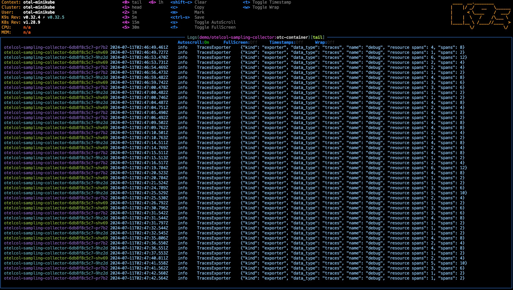

# Tail-Sampling with OpenTelemetry Collector

This example demonstrates Tail Sampling with the [OpenTelemetry collector](https://opentelemetry.io/docs/collector/) by using the [Tail Sampling Processor](https://github.com/open-telemetry/opentelemetry-collector-contrib/blob/main/processor/tailsamplingprocessor/README.md).  Traces are sampled based on the [defined sampling policy](https://github.com/bpschmitt/newrelic-opentelemetry-examples/blob/tail-sampling/other-examples/tail-sampling/sampling.yaml) and sent to New Relic via OTLP.


```mermaid
block-beta
columns 1
  Upstream("telemetrygen")
  space
  block:LB
    Loadbalancer_Collector
  end
  space
  block:ID
    Sampling_Collector_A
    Sampling_Collector_B
    Sampling_Collector_C
  end
  space
  NR("New Relic")
  
  Upstream --"Spans"--> LB
  LB --> Sampling_Collector_A
  LB --> Sampling_Collector_B
  LB --> Sampling_Collector_C
  Sampling_Collector_A --"Sampling"--> NR
  Sampling_Collector_B --"Sampling"--> NR
  Sampling_Collector_C --"Sampling"--> NR

  style Upstream fill:#000,stroke:#f66,stroke-width:2px,color:#fff,stroke-dasharray: 5 5
  style NR fill:#000,stroke:#03AC13,stroke-width:2px,color:#fff,stroke-dasharray: 5 5
```

## Requirements

* You need to have a Kubernetes cluster, and the kubectl command-line tool must be configured to communicate with your cluster. Docker desktop [includes a standalone Kubernetes server and client](https://docs.docker.com/desktop/kubernetes/) which is useful for local testing.
* [A New Relic account](https://one.newrelic.com/)
* [A New Relic license key](https://docs.newrelic.com/docs/apis/intro-apis/new-relic-api-keys/#license-key)
* [Telemetrygen](https://github.com/open-telemetry/opentelemetry-collector-contrib/tree/cmd/telemetrygen/v0.88.1/cmd/telemetrygen)


## Set up your cluster

As a prerequisite, you'll need to install both [Cert Manager](https://cert-manager.io/) and the [OpenTelemetry Operator for K8s](https://opentelemetry.io/docs/kubernetes/operator/) in your cluster.

### Cert Manager

Install [Cert Manager](https://cert-manager.io/) with the following command:

```shell
kubectl apply -f https://github.com/cert-manager/cert-manager/releases/download/v1.15.1/cert-manager.yaml
```

### OpenTelemetry Operator

Install the [OpenTelemetry Operator for K8s](https://opentelemetry.io/docs/kubernetes/operator/) with the following command: 
```shell
kubectl apply -f https://github.com/open-telemetry/opentelemetry-operator/releases/latest/download/opentelemetry-operator.yaml
```

If successful, you should see all Pods in a `Running` state.

```
$ kubectl get pods -A                                                                                                                                                            
NAMESPACE                       NAME                                                         READY   STATUS    RESTARTS       AGE
cert-manager                    cert-manager-5798486f6b-6fm2b                                1/1     Running   0              17m
cert-manager                    cert-manager-cainjector-7666685ff5-qbt8v                     1/1     Running   0              17m
cert-manager                    cert-manager-webhook-5f594df789-w5dkl                        1/1     Running   0              17m
kube-system                     coredns-5dd5756b68-dhm5f                                     1/1     Running   0              142m
kube-system                     etcd-otel-minikube                                           1/1     Running   0              143m
kube-system                     kube-apiserver-otel-minikube                                 1/1     Running   0              143m
kube-system                     kube-controller-manager-otel-minikube                        1/1     Running   0              143m
kube-system                     kube-proxy-w4sfq                                             1/1     Running   0              142m
kube-system                     kube-scheduler-otel-minikube                                 1/1     Running   0              143m
kube-system                     storage-provisioner                                          1/1     Running   1 (142m ago)   143m
opentelemetry-operator-system   opentelemetry-operator-controller-manager-54c987dd5b-5cqvh   2/2     Running   0              15m
```

## Running the example

### Create New Relic License Key Secret

In order for the OTel Collectors to authenticate successfully with New Relic's OTLP endpoint, you'll need to store your New Relic ingest license key in a Kubernetes Secret within the `demo` namespace.  Use the following command to create both the namespace and the secret:

```shell
kubectl create ns demo && kubectl create secret generic newrelic-license-key --from-literal=licensekey=<YOUR NR LICENSE KEY> -n demo
```

### Install OpenTelemetry Collectors

You'll be setting up a total of 4 OTel Collectors in this example.  The `loadbalancer` collector instance will use the [loadbalancing](https://github.com/open-telemetry/opentelemetry-collector-contrib/blob/main/exporter/loadbalancingexporter/README.md) exporter to ship spans to one of three `sampling` collector instances based on `trace.id` (the default `routing_key`).

Run the following commands to install all collector instances:
```shell
kubectl apply -f lb.yaml -n demo
kubectl apply -f sampling.yaml -n demo
```

You can validate that all are up and running by running `kubectl get pods -n demo`:

```shell
$ kubectl get pods -n demo
NAME                                              READY   STATUS    RESTARTS   AGE
demo-app-57cf4bdc99-57x2n                         2/2     Running   0          46h
otelcol-loadbalancer-collector-7fdc8fd969-vsfq6   1/1     Running   0          32h
otelcol-sampling-collector-6db8f8c5c7-9hz2d       1/1     Running   0          34m
otelcol-sampling-collector-6db8f8c5c7-pr7b2       1/1     Running   0          34m
otelcol-sampling-collector-6db8f8c5c7-shv69       1/1     Running   0          34m
```


### Port forward

You'll need to utilize port forwarding to open a port on your local machine to the OTel collector running in your cluster.  The following command will open up port 4317 on your localhost, which is what the `telemetrygen` tool uses by default.

```shell
kubectl port-forward svc/otelcol-loadbalancer-collector -n demo 4317 2>&1 >/dev/null &
```

To cancel out of the port forward session, enter the `fg` command to foreground it and then `ctrl + c` to cancel.

### Generate Traces

The `loagen.sh` shell script uses the `telemetrygen` tool to generate traces.  Ensure that you have `telemetrygen` installed on your machine and then run the loadgen script.

```shell
./loadgen.sh
```

If working successfully, you should see some output in your terminal that resembles the following:

```
...
2024-07-10T21:56:49.469-0500    INFO    grpc@v1.64.0/balancer_wrapper.go:103    [core][Channel #1]Channel switches to new LB policy "pick_first"        {"system": "grpc", "grpc_log": true}
2024-07-10T21:56:49.469-0500    INFO    grpc@v1.64.0/balancer_wrapper.go:170    [core][Channel #1 SubChannel #2]Subchannel created      {"system": "grpc", "grpc_log": true}
2024-07-10T21:56:49.469-0500    INFO    grpc@v1.64.0/clientconn.go:535  [core][Channel #1]Channel Connectivity change to CONNECTING     {"system": "grpc", "grpc_log": true}
2024-07-10T21:56:49.469-0500    INFO    grpc@v1.64.0/clientconn.go:1210 [core][Channel #1 SubChannel #2]Subchannel Connectivity change to CONNECTING    {"system": "grpc", "grpc_log": true}
2024-07-10T21:56:49.469-0500    INFO    grpc@v1.64.0/clientconn.go:1326 [core][Channel #1 SubChannel #2]Subchannel picks a new address "[::1]:4317" to connect  {"system": "grpc", "grpc_log": true}
2024-07-10T21:56:49.481-0500    INFO    grpc@v1.64.0/clientconn.go:1210 [core][Channel #1 SubChannel #2]Subchannel Connectivity change to READY {"system": "grpc", "grpc_log": true}
2024-07-10T21:56:49.481-0500    INFO    grpc@v1.64.0/clientconn.go:535  [core][Channel #1]Channel Connectivity change to READY  {"system": "grpc", "grpc_log": true}
2024-07-10T21:56:49.525-0500    INFO    grpc@v1.64.0/clientconn.go:535  [core][Channel #1]Channel Connectivity change to SHUTDOWN       {"system": "grpc", "grpc_log": true}
2024-07-10T21:56:49.525-0500    INFO    grpc@v1.64.0/resolver_wrapper.go:100    [core][Channel #1]Closing the name resolver     {"system": "grpc", "grpc_log": true}
2024-07-10T21:56:49.525-0500    INFO    grpc@v1.64.0/balancer_wrapper.go:135    [core][Channel #1]ccBalancerWrapper: closing    {"system": "grpc", "grpc_log": true}
2024-07-10T21:56:49.525-0500    INFO    grpc@v1.64.0/clientconn.go:1210 [core][Channel #1 SubChannel #2]Subchannel Connectivity change to SHUTDOWN      {"system": "grpc", "grpc_log": true}
2024-07-10T21:56:49.525-0500    INFO    grpc@v1.64.0/clientconn.go:1154 [core][Channel #1 SubChannel #2]Subchannel deleted      {"system": "grpc", "grpc_log": true}
2024-07-10T21:56:49.525-0500    INFO    grpc@v1.64.0/clientconn.go:1156 [core][Channel #1]Channel deleted       {"system": "grpc", "grpc_log": true}
2024-07-10T21:56:49.525-0500    INFO    traces/traces.go:64     stopping the exporter
```

## Viewing your data

After a minute or so, you'll start to see Spans populate in your New Relic account.  The following NRQL query can be used to validate that your setup is working and that a smaller percentage of traces are showing up for the `non-critical-service` compared to the `critical-service`.

```shell
from Span select uniqueCount(trace.id) where recipe = 'newrelic-tail-sampling' where service.name in ('critical-service', 'non-critical-service') facet service.name TIMESERIES 1 minute since 15 minutes ago
```

Notice that the number of traces for the `critical-service` is much higher than `non-critical-service`.  This is tail sampling via the OpenTelemetry Collector in action!


See [get started with querying](https://docs.newrelic.com/docs/query-your-data/explore-query-data/get-started/introduction-querying-new-relic-data/) for additional details on querying data in New Relic.

You can also validate that load balancing is working in your cluster by looking at the `otel-sampling-collector-*` pod logs. Take note that multiple pod names are all exporting traces. A tool like [k9s](https://k9scli.io/) can make this a breeze if you're not a `kubectl` jedi.



