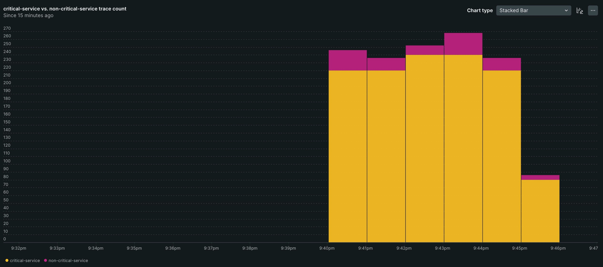

# Tail-Sampling with OpenTelemetry Collector

This simple example demonstrates Tail Sampling with the [OpenTelemetry collector](https://opentelemetry.io/docs/collector/), by using the [Tail Sampling Processor](https://github.com/open-telemetry/opentelemetry-collector-contrib/blob/main/processor/tailsamplingprocessor/README.md).  Traces are sampled based on the [defined sampling policy](https://linksomethinghere) and sent to New Relic via OTLP.


```mermaid
block-beta
columns 1
  Upstream("telemetrygen")
  space
  block:LB
    Loadbalancer_Collector
  end
  space
  block:ID
    Sampling_Collector_A
    Sampling_Collector_B
    Sampling_Collector_C
  end
  space
  NR("New Relic")
  
  Upstream --"Spans"--> LB
  LB --> Sampling_Collector_A
  LB --> Sampling_Collector_B
  LB --> Sampling_Collector_C
  Sampling_Collector_A --"Sampling"--> NR
  Sampling_Collector_B --"Sampling"--> NR
  Sampling_Collector_C --"Sampling"--> NR

  style Upstream fill:#000,stroke:#f66,stroke-width:2px,color:#fff,stroke-dasharray: 5 5
  style NR fill:#000,stroke:#03AC13,stroke-width:2px,color:#fff,stroke-dasharray: 5 5
```

## Requirements

* You need to have a Kubernetes cluster, and the kubectl command-line tool must be configured to communicate with your cluster. Docker desktop [includes a standalone Kubernetes server and client](https://docs.docker.com/desktop/kubernetes/) which is useful for local testing.
* [A New Relic account](https://one.newrelic.com/)
* [A New Relic license key](https://docs.newrelic.com/docs/apis/intro-apis/new-relic-api-keys/#license-key)
* [Telemetrygen] (https://github.com/open-telemetry/opentelemetry-collector-contrib/tree/cmd/telemetrygen/v0.88.1/cmd/telemetrygen)


## Set up your cluster

As a prerequisite, you'll need to install both [Cert Manager](https://cert-manager.io/) and the [OpenTelemetry Operator for K8s](https://opentelemetry.io/docs/kubernetes/operator/) in your cluster.

### Cert Manager

Install [Cert Manager](https://cert-manager.io/) with the following command:

```
kubectl apply -f https://github.com/cert-manager/cert-manager/releases/download/v1.15.1/cert-manager.yaml
```

### OpenTelemetry Operator

Install the [OpenTelemetry Operator for K8s](https://opentelemetry.io/docs/kubernetes/operator/) with the following command: 
```
kubectl apply -f https://github.com/open-telemetry/opentelemetry-operator/releases/latest/download/opentelemetry-operator.yaml
```

If successful, you should see all Pods in a `Running` state.

```
$ kubectl get pods -A                                                                                                                                                            
NAMESPACE                       NAME                                                         READY   STATUS    RESTARTS       AGE
cert-manager                    cert-manager-5798486f6b-6fm2b                                1/1     Running   0              17m
cert-manager                    cert-manager-cainjector-7666685ff5-qbt8v                     1/1     Running   0              17m
cert-manager                    cert-manager-webhook-5f594df789-w5dkl                        1/1     Running   0              17m
kube-system                     coredns-5dd5756b68-dhm5f                                     1/1     Running   0              142m
kube-system                     etcd-otel-minikube                                           1/1     Running   0              143m
kube-system                     kube-apiserver-otel-minikube                                 1/1     Running   0              143m
kube-system                     kube-controller-manager-otel-minikube                        1/1     Running   0              143m
kube-system                     kube-proxy-w4sfq                                             1/1     Running   0              142m
kube-system                     kube-scheduler-otel-minikube                                 1/1     Running   0              143m
kube-system                     storage-provisioner                                          1/1     Running   1 (142m ago)   143m
opentelemetry-operator-system   opentelemetry-operator-controller-manager-54c987dd5b-5cqvh   2/2     Running   0              15m
```

## Running the example

### Create New Relic License Key Secret

In order for the OTel Collectors to authenticate successfully with New Relic's OTLP endpoint, you'll need to store your New Relic ingest license key in a Kubernetes Secret within the `demo` namespace.  Use the following command to create both the namespace and the secret:

```
kubectl create ns demo && kubectl create secret generic newrelic-license-key --from-literal=licensekey=<YOUR NR LICENSE KEY> -n demo
```

### Install OpenTelemetry Collectors

```
kubectl apply -f lb.yaml -n demo
kubectl apply -f sampling.yaml -n demo
```

### Port forward

You'll need to utilize port forwarding to open a port on your local machine to the OTel collector running in your cluster.  The following command will open up port 4317 on your localhost, which is what the `telemetrygen` tool uses by default.

```
kubectl port-forward svc/otelcol-loadbalancer-collector -n demo 4317
```

Use `ctrl + c` to cancel out of the port forward session.

### Telemetry


```
telemetrygen traces --traces 100 --otlp-insecure --otlp-attributes='recipe="newrelic-tail-sampling"' --otlp-attributes='vip="true"'
telemetrygen traces --traces 100 --otlp-insecure --otlp-attributes='recipe="newrelic-tail-sampling"' --otlp-attributes='vip="false"'
```

## Viewing your data

To review your test data in New Relic, navigate to "New Relic -> Query Your Data". To list the Spans reported, query for:

```
FROM Span select count(*) facet vip since 10 minutes ago TIMESERIES 
```





See [get started with querying](https://docs.newrelic.com/docs/query-your-data/explore-query-data/get-started/introduction-querying-new-relic-data/) for additional details on querying data in New Relic.

## Additional notes

The prometheus receiver includes `service.name` and `service.instance.id` resource attributes derived from job name and target configured in `.receivers.prometheus.config.scrape_configs`. As documented [here](https://docs.newrelic.com/docs/more-integrations/open-source-telemetry-integrations/opentelemetry/best-practices/opentelemetry-best-practices-resources/#services), New Relic considers any data with `service.name` as a service despite the fact that not all prometheus data sources are services. As a result, you can find a `confluent` entity under "New Relic -> All Entities -> Services - OpenTelemetry", although the panels will not contain data because the scraped metrics do not represent APM data.
